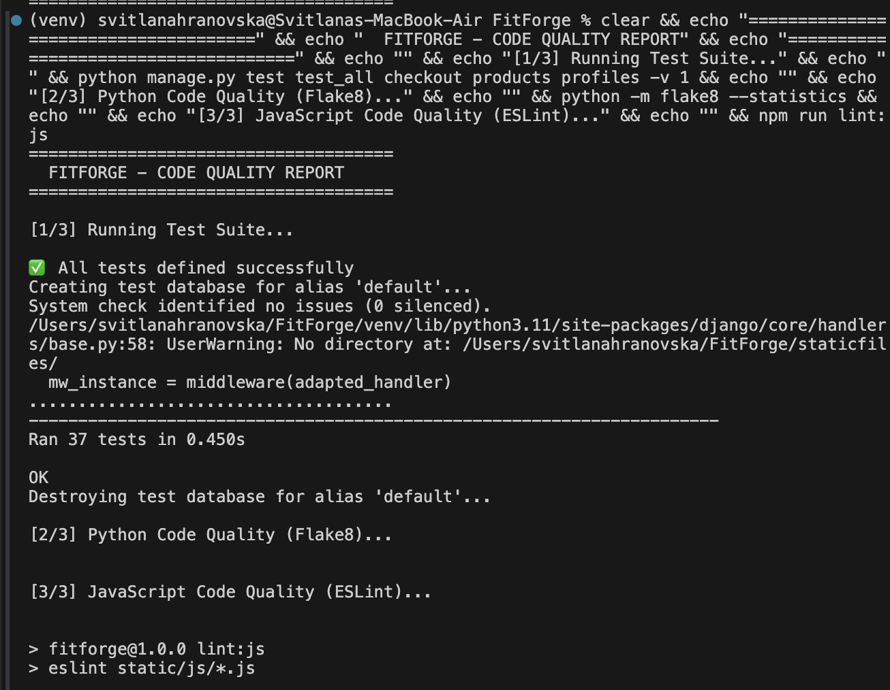

# Testing Documentation

This document records the testing process for FitForge, including automated checks, manual QA, validator evidence, performance evidence, and bugs found and fixed during development.



---

## Table of Contents

- [Automated Testing](#automated-testing)
   - [Test Scope](#test-scope)
   - [Latest Test Run](#latest-test-run)
   - [TDD and Iterative Test Evidence](#tdd-and-iterative-test-evidence)
   - [How to Run Tests](#how-to-run-tests)
      - [Option 1 - Django test runner directly](#option-1--django-test-runner-directly)
      - [Option 2 - test_runner.sh](#option-2--test_runnersh)
      - [Option 3 - test_code_quality.sh](#option-3--test_code_qualitysh)
- [Manual Testing](#manual-testing)
   - [Authentication and Account Testing](#authentication-and-account-testing)
   - [Membership Testing](#membership-testing)
   - [Classes, Schedule, and Booking Testing](#classes-schedule-and-booking-testing)
   - [Products, Bag, and Checkout Testing](#products-bag-and-checkout-testing)
   - [Profile and Role-Based Access Testing](#profile-and-role-based-access-testing)
   - [Static Pages and Error Handling](#static-pages-and-error-handling)
- [Code Validation](#code-validation)
   - [HTML Validation](#html-validation)
   - [CSS Validation](#css-validation)
   - [Python and JavaScript Validation](#python-and-javascript-validation)
- [Responsive and Cross-Device Testing](#responsive-and-cross-device-testing)
- [Lighthouse and Performance Testing](#lighthouse-and-performance-testing)
- [Email and Payment Testing](#email-and-payment-testing)
- [Deployment Security Checks](#deployment-security-checks)
- [Bugs Fixed During Development and QA](#bugs-fixed-during-development-and-qa)
- [Known Minor Issues](#known-minor-issues)
- [Complete Screenshot Evidence Index](#complete-screenshot-evidence-index)
- [Conclusion](#conclusion)

---

## Automated Testing

### Test Scope

The project contains automated tests covering important model, view, permission, checkout, and profile behaviour.

Primary test sources include:
- `test_all.py`
- `checkout/tests.py`
- `products/tests.py`
- `profiles/tests.py`

The automated suite focuses on the critical paths of the application:
- account and authentication behaviour
- product and checkout logic
- profile creation and access
- core business rules tied to the project apps

### Latest Test Run

Latest recorded local result:

```text
Ran 37 tests in 0.448s

OK
```

Evidence:
- [Combined validation and test evidence](docs/Screenshots/Tests_CodeValidation_results.png)
- [Dedicated test runner script output](docs/Screenshots/test_runner_script_result.png)

### TDD and Iterative Test Evidence

FitForge shows a long iterative development history (**276 commits**) with repeated “write/fix → test → verify → commit” cycles.

The practical workflow used throughout development:

1. reproduce issue with manual checks or test run
2. implement a focused code change
3. re-run automated tests and code-quality checks
4. commit only after verification

Commit evidence of test-first / test-after-fix behavior:

| Phase | Commit | Evidence |
|---|---|---|
| Build core test base | [7677a9d](https://github.com/vsessvit/FitForge/commit/7677a9d) | Added comprehensive automated test suite |
| Expand test coverage by app | [f5bfa29](https://github.com/vsessvit/FitForge/commit/f5bfa29) | Added app-specific test suites |
| Stabilize test environment | [e6cdc0c](https://github.com/vsessvit/FitForge/commit/e6cdc0c) | Added test-specific static files behavior |
| Add repeatable test scripts | [225374a](https://github.com/vsessvit/FitForge/commit/225374a) | Added `test_runner.sh` and code-quality workflow |
| Fix profile/checkout regressions then re-test | [025ea72](https://github.com/vsessvit/FitForge/commit/025ea72) | Fixed profile 404 and membership checkout form logic |
| Fix checkout calculation bug then re-test | [157315c](https://github.com/vsessvit/FitForge/commit/157315c) | Fixed `Decimal`/`float` order total issue |
| Improve lint/test script reliability | [e188d64](https://github.com/vsessvit/FitForge/commit/e188d64) | Cleaned lint config and script behavior |
| Remove remaining test warnings | [8dcb2ce](https://github.com/vsessvit/FitForge/commit/8dcb2ce) | Fixed pagination ordering + test middleware setup |

This provides clear evidence that testing was continuous and integrated into development decisions, not only performed at the end.

### How to Run Tests

#### Option 1 - Django test runner directly

Use this when you want the standard Django output without any wrapper script.

```bash
source .venv/bin/activate
export DEVELOPMENT=1
export SECRET_KEY='your-secret-key'
export ALLOWED_HOSTS='localhost,127.0.0.1,testserver'
python manage.py test
```

Note: `testserver` is needed for Django test client requests.

#### Option 2 - `test_runner.sh`

This script was added to make it easier to run the Django suite with one command and get a clearer terminal summary for project QA and screenshots.

**Why it was added:**
- to avoid repeatedly typing environment and test commands
- to make output easier to read during submission preparation
- to provide a cleaner screenshot of a successful automated test run

**What it does:**
- sets local-safe defaults for `DEVELOPMENT`, `SECRET_KEY`, and `ALLOWED_HOSTS` if not already exported
- runs `python manage.py test --verbosity=2`
- prints a clear banner before execution
- shows a simple coloured pass/fail summary afterwards
- returns the Django exit status so failures are still real failures

**How to run it:**

```bash
chmod +x test_runner.sh
./test_runner.sh
```

Optional (if you want to set env vars manually first):

```bash
source .venv/bin/activate
export DEVELOPMENT=1
export SECRET_KEY='your-secret-key'
export ALLOWED_HOSTS='localhost,127.0.0.1,testserver'
./test_runner.sh
```

Evidence:
- [test_runner.sh result](docs/Screenshots/test_runner_script_result.png)

#### Option 3 - `test_code_quality.sh`

This script was added so Python and JavaScript code quality checks could be run together from one command.

**Why it was added:**
- to speed up final QA work
- to keep Flake8 and ESLint checks consistent
- to make it easy to capture one clear screenshot showing code-quality status

**What it does:**
- activates `.venv` or `venv` if present
- runs `python -m flake8 . --statistics --count`
- runs `npm run lint:js`
- prints a summary showing whether the codebase is clean
- checks that production-style error page and `DEBUG` safeguards exist in settings

**How to run it:**

```bash
chmod +x test_code_quality.sh
./test_code_quality.sh
```

Evidence:
- [test_code_quality.sh result](docs/Screenshots/code_quality_script_result.png)

---

## Manual Testing

Manual testing was carried out across the main user journeys and special business rules of the application.

### Authentication and Account Testing

| Test Case | Expected Result | Status | Evidence |
|---|---|---|---|
| Login with invalid credentials | User sees an error and is not logged in | ✅ | [Login_Error.png](docs/Screenshots/Login_Error.png) |
| Password reset page uses FitForge styling | Page renders with custom branded layout | ✅ | [Password_reset_page.png](docs/Screenshots/Password_reset_page.png) |
| Registration empty/invalid submission | Validation messages are shown | ✅ | [RegForm_Error.png](docs/Screenshots/RegForm_Error.png) |
| Missing username | Username validation appears | ✅ | [RegForm_NOUserName_Error.png](docs/Screenshots/RegForm_NOUserName_Error.png) |
| Missing password | Password validation appears | ✅ | [RegForm_NoPassword_Error.png](docs/Screenshots/RegForm_NoPassword_Error.png) |
| Password too short | Minimum length validation appears | ✅ | [RegForm_PasswordTooShort_Error.png](docs/Screenshots/RegForm_PasswordTooShort_Error.png) |
| Password mismatch | User sees mismatch warning | ✅ | [RegForm_PasswordsMustMatch_Error.png](docs/Screenshots/RegForm_PasswordsMustMatch_Error.png) |
| Username too short / invalid | Validation prevents submission | ✅ | [RegForm_ShortName_Error.png](docs/Screenshots/RegForm_ShortName_Error.png) |
| Existing username | Duplicate account creation is blocked | ✅ | [RegForm_UsermaneAlreadyExists_Error.png](docs/Screenshots/RegForm_UsermaneAlreadyExists_Error.png), [UserAlreadyExists_Error.png](docs/Screenshots/UserAlreadyExists_Error.png) |
| Sign-out confirmation | User sees a styled sign-out warning page | ✅ | [SignOut_Warning.png](docs/Screenshots/SignOut_Warning.png) |

### Membership Testing

| Test Case | Expected Result | Status | Evidence |
|---|---|---|---|
| Profile before membership purchase | No active membership shown yet | ✅ | [User_account_before_bying_the_membership.png](docs/Screenshots/User_account_before_bying_the_membership.png) |
| Add membership to bag | Success message appears | ✅ | [Membership_added_to_the_bag_popup_message.png](docs/Screenshots/Membership_added_to_the_bag_popup_message.png), [Added_Premium membership_to_your_bag_popup_message.png](docs/Screenshots/Added_Premium%20membership_to_your_bag_popup_message.png) |
| Membership-only checkout | Only the relevant visible fields are shown | ✅ | [2_fields_when_bying_just_a_membership.png](docs/Screenshots/2_fields_when_bying_just_a_membership.png) |
| Membership checkout form page | Checkout screen renders correctly | ✅ | [Membership_confirmation_form.png](docs/Screenshots/Membership_confirmation_form.png) |
| Successful membership activation | User sees success feedback | ✅ | [Membership_successfully_activated_popup_message.png](docs/Screenshots/Membership_successfully_activated_popup_message.png) |
| Membership added to profile | Active plan appears in profile | ✅ | [Membership_added_to_MyProfile.png](docs/Screenshots/Membership_added_to_MyProfile.png), [Membersip_added_to_MyProfile.png](docs/Screenshots/Membersip_added_to_MyProfile.png), [When_Membership_bought_its_added_to_MyProfile.png](docs/Screenshots/When_Membership_bought_its_added_to_MyProfile.png) |
| Cancel membership | Warning/confirmation appears before cancellation | ✅ | [Cancel_membership_Warning_message.png](docs/Screenshots/Cancel_membership_Warning_message.png) |

### Classes, Schedule, and Booking Testing

| Test Case | Expected Result | Status | Evidence |
|---|---|---|---|
| Classes page shows content | User can view available classes | ✅ | [ClassDetail_page_user_view.png](docs/Screenshots/ClassDetail_page_user_view.png) |
| Filter classes by class type | Only matching classes remain visible | ✅ | [Classes_filter_by_class_example.png](docs/Screenshots/Classes_filter_by_class_example.png) |
| Sort classes | Sort order changes correctly | ✅ | [Classes_SortBy_example.png](docs/Screenshots/Classes_SortBy_example.png) |
| Empty result set | User sees an informative empty-state message | ✅ | [NoClasses_Message.png](docs/Screenshots/NoClasses_Message.png) |
| Booking blocked without membership | User sees a restriction message | ✅ | [You_need_membership_to_book_classes_message.png](docs/Screenshots/You_need_membership_to_book_classes_message.png) |
| Admin can edit class content | Update success confirmation is shown | ✅ | [ClassEdited_Confirmation_poup_message.png](docs/Screenshots/ClassEdited_Confirmation_poup_message.png) |
| My bookings page | User can review bookings | ✅ | [HtmlChecker_my_bookings.png](docs/Screenshots/HtmlChecker_my_bookings.png) |

### Products, Bag, and Checkout Testing

| Test Case | Expected Result | Status | Evidence |
|---|---|---|---|
| Add product to bag | Success message appears | ✅ | [AddToBag_success_message.png](docs/Screenshots/AddToBag_success_message.png) |
| Bag shows selected item | Product is shown in the bag | ✅ | [Item_in_shopping_bag.png](docs/Screenshots/Item_in_shopping_bag.png) |
| Checkout for products | Checkout form renders with delivery fields when needed | ✅ | [Checkout_form.png](docs/Screenshots/Checkout_form.png), [Chechout_form_with_delivery.png](docs/Screenshots/Chechout_form_with_delivery.png) |
| Remove item from bag | Removal message appears | ✅ | [Removed_the_item_from_the_cart.png](docs/Screenshots/Removed_the_item_from_the_cart.png) |
| Complete order | Success feedback appears after payment | ✅ | [Order_successfully_processed_popup_message.png](docs/Screenshots/Order_successfully_processed_popup_message.png) |
| Product detail page | Product details render correctly | ✅ | [Product_Detail_page_user_view.png](docs/Screenshots/Product_Detail_page_user_view.png) |
| Product edit/update | Product update feedback is shown | ✅ | [Product_updated.png](docs/Screenshots/Product_updated.png) |
| Admin updates product image | Product image can be managed through admin | ✅ | [Admin_updating_picture_for_product.png](docs/Screenshots/Admin_updating_picture_for_product.png) |

### Profile and Role-Based Access Testing

| Test Case | Expected Result | Status | Evidence |
|---|---|---|---|
| Regular user navigation | Admin-only options stay hidden | ✅ | [Not_admin_user_menu_options.png](docs/Screenshots/Not_admin_user_menu_options.png) |
| Regular user on content detail | No admin controls visible | ✅ | [No_edit_delete_option_for_the_user.png](docs/Screenshots/No_edit_delete_option_for_the_user.png) |
| Admin/staff view | Extra management controls visible | ✅ | [Edit_delete_options_for_admin.png](docs/Screenshots/Edit_delete_options_for_admin.png) |

### Static Pages and Error Handling

| Test Case | Expected Result | Status | Evidence |
|---|---|---|---|
| Homepage loads correctly | Main content and CTAs render | ✅ | [Full_homepage_desktop.png](docs/Screenshots/Full_homepage_desktop.png), [Full_page_mobil;e.png](docs/Screenshots/Full_page_mobil;e.png) |
| Contact / FAQ / policy pages render | Static content pages display correctly | ✅ | See HTML and Lighthouse evidence below |
| 404 page | Missing routes display custom 404 page | ✅ | [404_Error_page.png](docs/Screenshots/404_Error_page.png) |
| 500 page | Server error route displays custom 500 page | ✅ | [500_Error.png](docs/Screenshots/500_Error.png) |

---

## Code Validation

### HTML Validation

HTML was checked with the W3C Markup Validator across the main templates.

Evidence:
- [HtmlChecker_base.png](docs/Screenshots/HtmlChecker_base.png)
- [HtmlChecker_login.png](docs/Screenshots/HtmlChecker_login.png)
- [HtmlChecker_signup.png](docs/Screenshots/HtmlChecker_signup.png)
- [Html Checker_logout.png](docs/Screenshots/Html%20Checker_logout.png)
- [HtmlChecker_bag.png](docs/Screenshots/HtmlChecker_bag.png)
- [HtmlChecker_shop.png](docs/Screenshots/HtmlChecker_shop.png)
- [HtmlChecker_add_product.png](docs/Screenshots/HtmlChecker_add_product.png)
- [HtmlChecker_all_classes.png](docs/Screenshots/HtmlChecker_all_classes.png)
- [HtmlChecker_add_class.png](docs/Screenshots/HtmlChecker_add_class.png)
- [HtmlChecker_create_schedule.png](docs/Screenshots/HtmlChecker_create_schedule.png)
- [HtmlChecker_schedule_list.png](docs/Screenshots/HtmlChecker_schedule_list.png)
- [HtmlChecker_membership_plans.png](docs/Screenshots/HtmlChecker_membership_plans.png)
- [HtmlChecker_my_bookings.png](docs/Screenshots/HtmlChecker_my_bookings.png)
- [HtmlChecker_profile.png](docs/Screenshots/HtmlChecker_profile.png)
- [HtmlChecker_contact.png](docs/Screenshots/HtmlChecker_contact.png)
- [HtmlChecker_faq.png](docs/Screenshots/HtmlChecker_faq.png)
- [HtmlChecker_terms.png](docs/Screenshots/HtmlChecker_terms.png)
- [HtmlChecker_privacy.png](docs/Screenshots/HtmlChecker_privacy.png)

### CSS Validation

CSS files were validated with the W3C CSS Validator.

Evidence:
- [Base.css_validation.png](docs/Screenshots/Base.css_validation.png)
- [Checkout.css_validation.png](docs/Screenshots/Checkout.css_validation.png)
- [Memberships.css_validation.png](docs/Screenshots/Memberships.css_validation.png)

### Python and JavaScript Validation

Python and JavaScript quality checks are part of the custom QA workflow.

Commands:

```bash
python -m flake8 .
npm run lint:js
```

Evidence:
- [Tests_CodeValidation_results.png](docs/Screenshots/Tests_CodeValidation_results.png)
- [code_quality_script_result.png](docs/Screenshots/code_quality_script_result.png)

---

## Responsive and Cross-Device Testing

Responsive testing was carried out with responsive tooling and real-device screenshots.

Evidence:
- [I_am_responsive.png](docs/Screenshots/I_am_responsive.png)
- [ResponsiveChecker_desktop.png](docs/Screenshots/ResponsiveChecker_desktop.png)
- [ResponsiveChecker_Desktop20.png](docs/Screenshots/ResponsiveChecker_Desktop20.png)
- [ResponsiveChecker_real_MacBook13,6.png](docs/Screenshots/ResponsiveChecker_real_MacBook13,6.png)
- [ResponsiveChecker_iPadMini.png](docs/Screenshots/ResponsiveChecker_iPadMini.png)
- [ResponsiveChecker_iPadPro.png](docs/Screenshots/ResponsiveChecker_iPadPro.png)
- [ResponsiveChecker_SamsungGalaxyTab10.png](docs/Screenshots/ResponsiveChecker_SamsungGalaxyTab10.png)
- [ResponsiveChecker_GooglePixel.png](docs/Screenshots/ResponsiveChecker_GooglePixel.png)
- [ResponsiveChecker_iPhone15ProMax_real.jpeg](docs/Screenshots/ResponsiveChecker_iPhone15ProMax_real.jpeg)

Outcome:
- layouts remained usable across desktop, tablet, and mobile
- navigation, cards, forms, and buttons remained accessible on smaller screens
- mobile screenshots confirmed the homepage and core flows are presentation-ready

---

## Lighthouse and Performance Testing

Lighthouse evidence was collected for both mobile and desktop views across important pages.

### Desktop Lighthouse Evidence
- [LightHouse_Profile_desktop.png](docs/Screenshots/LightHouse_Profile_desktop.png)
- [Lighthouse_MyBookings_desktop.png](docs/Screenshots/Lighthouse_MyBookings_desktop.png)
- [Lighthouse_PasswordReset_desktop.png](docs/Screenshots/Lighthouse_PasswordReset_desktop.png)
- [Lighthouse_AddNewProduct_desktop.png](docs/Screenshots/Lighthouse_AddNewProduct_desktop.png)
- [Lighthouse_AddNewClass_desktop.png](docs/Screenshots/Lighthouse_AddNewClass_desktop.png)
- [Lighthouse_AddSchedule_desktop.png](docs/Screenshots/Lighthouse_AddSchedule_desktop.png)
- [Lighthouse_ConfirmE-mailAddress_desktop.png](docs/Screenshots/Lighthouse_ConfirmE-mailAddress_desktop.png)
- [Lighthouse_SignOut_desktop.png](docs/Screenshots/Lighthouse_SignOut_desktop.png)

### Mobile Lighthouse Evidence
- [Lighthouse_HomePage_mobile.png](docs/Screenshots/Lighthouse_HomePage_mobile.png)
- [Lighthouse_classes_mobile.png](docs/Screenshots/Lighthouse_classes_mobile.png)
- [Lighthouse_classes_mobile copy.png](docs/Screenshots/Lighthouse_classes_mobile%20copy.png)
- [Lighthouse_ClassSchesule_mobile.png](docs/Screenshots/Lighthouse_ClassSchesule_mobile.png)
- [Lighthouse_shop_mobile.png](docs/Screenshots/Lighthouse_shop_mobile.png)
- [Lighthouse_AddANewClass_mobile.png](docs/Screenshots/Lighthouse_AddANewClass_mobile.png)
- [Lighthouse_AddANewProduct_mobile.png](docs/Screenshots/Lighthouse_AddANewProduct_mobile.png)
- [Lighthouse_bag_mobile.png](docs/Screenshots/Lighthouse_bag_mobile.png)
- [Lighthouse_ShoppingBag_mobile.png](docs/Screenshots/Lighthouse_ShoppingBag_mobile.png)
- [Lighthouse_ProductDetail_mobile.png](docs/Screenshots/Lighthouse_ProductDetail_mobile.png)
- [Lighthouse_profile_mobile.png](docs/Screenshots/Lighthouse_profile_mobile.png)
- [Lighthouse_schedule_mobile.png](docs/Screenshots/Lighthouse_schedule_mobile.png)
- [Lighthouse_memberships_mobile.png](docs/Screenshots/Lighthouse_memberships_mobile.png)
- [Lighthouse_MyBookings_mobile.png](docs/Screenshots/Lighthouse_MyBookings_mobile.png)
- [Lighthouse_FAQ_mobile.png](docs/Screenshots/Lighthouse_FAQ_mobile.png)
- [Lighthouse_ContactUs_mobile.png](docs/Screenshots/Lighthouse_ContactUs_mobile.png)
- [Lighthouse_term_mobile.png](docs/Screenshots/Lighthouse_term_mobile.png)
- [Lighthouse_policy_mobile.png](docs/Screenshots/Lighthouse_policy_mobile.png)
- [Lighthouse_logout_mobile.png](docs/Screenshots/Lighthouse_logout_mobile.png)

Summary:
- mobile performance was iteratively improved through image optimisation, deferred scripts, pagination, and reduced connection overhead
- additional CSS and asset changes were made after testing to improve slower class and shop pages

---

## Email and Payment Testing

### Email Testing

Verified scenarios:
- account confirmation and branded email presentation
- password reset email content
- checkout confirmation email delivery

Evidence:
- [Confirmation_email.png](docs/Screenshots/Confirmation_email.png)
- [Confirmation_email_real_example.png](docs/Screenshots/Confirmation_email_real_example.png)
- [Confirmation_email_was_sent.png](docs/Screenshots/Confirmation_email_was_sent.png)
- [Confirmation_email_when_forgot_password.png](docs/Screenshots/Confirmation_email_when_forgot_password.png)

### Payment Testing

Verified scenarios:
- checkout form rendering for physical and membership-only orders
- order success feedback
- membership activation after successful payment

Evidence:
- [Checkout_form.png](docs/Screenshots/Checkout_form.png)
- [Chechout_form_with_delivery.png](docs/Screenshots/Chechout_form_with_delivery.png)
- [2_fields_when_bying_just_a_membership.png](docs/Screenshots/2_fields_when_bying_just_a_membership.png)
- [Order_successfully_processed_popup_message.png](docs/Screenshots/Order_successfully_processed_popup_message.png)
- [Membership_successfully_activated_popup_message.png](docs/Screenshots/Membership_successfully_activated_popup_message.png)

---

## Deployment Security Checks

Production configuration checks were run using Django's deploy checker.

Command:

```bash
source .venv/bin/activate
export DEVELOPMENT=0
export SECRET_KEY='your-long-random-production-secret'
export ALLOWED_HOSTS='fit-forge-28d11490cba0.herokuapp.com'
python manage.py check --deploy
```

Result:
- No deployment security issues reported after hardening settings.

Coverage of key deploy checks:
- HTTPS redirect enabled
- secure session/CSRF cookies enabled
- HSTS enabled
- production `DEBUG` behavior controlled by environment

---

## Bugs Fixed During Development and QA

The following issues were found during testing and corrected as part of the development process.

| Bug | Description | Fix | Commit |
|---|---|---|---|
| Password reset page used unstyled default allauth layout | Account pages did not match the rest of the app | Custom account templates and styling were added | [8f46f45](https://github.com/vsessvit/FitForge/commit/8f46f45) |
| Allauth email branding showed `example.com` fallback values | Email subjects/content looked unfinished in production | Site and email branding were corrected | [8107429](https://github.com/vsessvit/FitForge/commit/8107429) |
| Regular user profile returned 404 | Some users had no profile object created yet | Profile retrieval changed to `get_or_create`, signals were hardened | [025ea72](https://github.com/vsessvit/FitForge/commit/025ea72) |
| Membership-only checkout still showed delivery-style form fields | Checkout UX was confusing for membership-only orders | Membership-only form path now shows only the relevant visible fields | [025ea72](https://github.com/vsessvit/FitForge/commit/025ea72) |
| Checkout failed with `Decimal` + `float` total calculation error | Order total logic mixed numeric types | Delivery settings were converted safely to `Decimal` values | [157315c](https://github.com/vsessvit/FitForge/commit/157315c) |
| Stripe billing details JS did not handle simplified membership-only form well | Missing fields could cause checkout issues | Billing details collection was hardened to only send existing fields | [157315c](https://github.com/vsessvit/FitForge/commit/157315c) |
| Code-quality script initially surfaced thousands of irrelevant issues from an extra virtualenv | Flake8 was reading unintended environment files | Script and configuration were cleaned up and the intended env handling was improved | [e188d64](https://github.com/vsessvit/FitForge/commit/e188d64) |
| Mobile performance on homepage, classes, schedule, shop, and detail pages was too low | Large assets and rendering overhead hurt Lighthouse scores | Performance optimisations were applied across templates, images, pagination, and assets | [57bd649](https://github.com/vsessvit/FitForge/commit/57bd649), [bcbe949](https://github.com/vsessvit/FitForge/commit/bcbe949), [dfb9c2d](https://github.com/vsessvit/FitForge/commit/dfb9c2d) |
| Schedule pagination/buttons still showed Bootstrap blue instead of FitForge gold | Theme consistency was broken on the schedules page | Pagination/button colour overrides were strengthened | [ba6a195](https://github.com/vsessvit/FitForge/commit/ba6a195), [700fc89](https://github.com/vsessvit/FitForge/commit/700fc89) |

---

## Known Minor Issues

- Browsers or DevTools may request non-project files such as `/.well-known/appspecific/com.chrome.devtools.json`; these harmless 404s do not affect functionality.
- Browsers may also request `/apple-touch-icon.png` if one is not supplied. This is cosmetic only.
- Cached CSS can briefly make style changes appear missing until the page is hard refreshed.

---

## Complete Screenshot Evidence Index

This section ensures every screenshot stored in `docs/Screenshots` is referenced in the documentation set.

### Core UI and Feature Evidence

- [2_fields_when_bying_just_a_membership.png](docs/Screenshots/2_fields_when_bying_just_a_membership.png)
- [404_Error_page.png](docs/Screenshots/404_Error_page.png)
- [500_Error.png](docs/Screenshots/500_Error.png)
- [Added_Premium membership_to_your_bag_popup_message.png](docs/Screenshots/Added_Premium%20membership_to_your_bag_popup_message.png)
- [AddToBag_success_message.png](docs/Screenshots/AddToBag_success_message.png)
- [Admin_updating_picture_for_product.png](docs/Screenshots/Admin_updating_picture_for_product.png)
- [Cancel_membership_Warning_message.png](docs/Screenshots/Cancel_membership_Warning_message.png)
- [Chechout_form_with_delivery.png](docs/Screenshots/Chechout_form_with_delivery.png)
- [Checkout_form.png](docs/Screenshots/Checkout_form.png)
- [ClassDetail_page_user_view.png](docs/Screenshots/ClassDetail_page_user_view.png)
- [ClassEdited_Confirmation_poup_message.png](docs/Screenshots/ClassEdited_Confirmation_poup_message.png)
- [Classes_filter_by_class_example.png](docs/Screenshots/Classes_filter_by_class_example.png)
- [Classes_SortBy_example.png](docs/Screenshots/Classes_SortBy_example.png)
- [Confirmation_email.png](docs/Screenshots/Confirmation_email.png)
- [Confirmation_email_real_example.png](docs/Screenshots/Confirmation_email_real_example.png)
- [Confirmation_email_was_sent.png](docs/Screenshots/Confirmation_email_was_sent.png)
- [Confirmation_email_when_forgot_password.png](docs/Screenshots/Confirmation_email_when_forgot_password.png)
- [Edit_delete_options_for_admin.png](docs/Screenshots/Edit_delete_options_for_admin.png)
- [Full_homepage_desktop.png](docs/Screenshots/Full_homepage_desktop.png)
- [Full_page_mobile.png](docs/Screenshots/Full_page_mobile.png)
- [Item_in_shopping_bag.png](docs/Screenshots/Item_in_shopping_bag.png)
- [Login_Error.png](docs/Screenshots/Login_Error.png)
- [Membership_added_to_MyProfile.png](docs/Screenshots/Membership_added_to_MyProfile.png)
- [Membership_added_to_the_bag_popup_message.png](docs/Screenshots/Membership_added_to_the_bag_popup_message.png)
- [Membership_confirmation_form.png](docs/Screenshots/Membership_confirmation_form.png)
- [Membership_successfully_activated_popup_message.png](docs/Screenshots/Membership_successfully_activated_popup_message.png)
- [Membersip_added_to_MyProfile.png](docs/Screenshots/Membersip_added_to_MyProfile.png)
- [No_edit_delete_option_for_the_user.png](docs/Screenshots/No_edit_delete_option_for_the_user.png)
- [NoClasses_Message.png](docs/Screenshots/NoClasses_Message.png)
- [Not_admin_user_menu_options.png](docs/Screenshots/Not_admin_user_menu_options.png)
- [Order_successfully_processed_popup_message.png](docs/Screenshots/Order_successfully_processed_popup_message.png)
- [Password_reset_page.png](docs/Screenshots/Password_reset_page.png)
- [Product_Detail_page_user_view.png](docs/Screenshots/Product_Detail_page_user_view.png)
- [Product_updated.png](docs/Screenshots/Product_updated.png)
- [RegForm_Error.png](docs/Screenshots/RegForm_Error.png)
- [RegForm_NoPassword_Error.png](docs/Screenshots/RegForm_NoPassword_Error.png)
- [RegForm_NOUserName_Error.png](docs/Screenshots/RegForm_NOUserName_Error.png)
- [RegForm_PasswordsMustMatch_Error.png](docs/Screenshots/RegForm_PasswordsMustMatch_Error.png)
- [RegForm_PasswordTooShort_Error.png](docs/Screenshots/RegForm_PasswordTooShort_Error.png)
- [RegForm_ShortName_Error.png](docs/Screenshots/RegForm_ShortName_Error.png)
- [RegForm_UsermaneAlreadyExists_Error.png](docs/Screenshots/RegForm_UsermaneAlreadyExists_Error.png)
- [Removed_the_item_from_the_cart.png](docs/Screenshots/Removed_the_item_from_the_cart.png)
- [SignOut_Warning.png](docs/Screenshots/SignOut_Warning.png)
- [User_account_before_bying_the_membership.png](docs/Screenshots/User_account_before_bying_the_membership.png)
- [UserAlreadyExists_Error.png](docs/Screenshots/UserAlreadyExists_Error.png)
- [When_Membership_bought_its_added_to_MyProfile.png](docs/Screenshots/When_Membership_bought_its_added_to_MyProfile.png)
- [You_need_membership_to_book_classes_message.png](docs/Screenshots/You_need_membership_to_book_classes_message.png)

### HTML, CSS, and Code Validation Evidence

- [Base.css_validation.png](docs/Screenshots/Base.css_validation.png)
- [Checkout.css_validation.png](docs/Screenshots/Checkout.css_validation.png)
- [Memberships.css_validation.png](docs/Screenshots/Memberships.css_validation.png)
- [Html Checker_logout.png](docs/Screenshots/Html%20Checker_logout.png)
- [HtmlChecker_add_class.png](docs/Screenshots/HtmlChecker_add_class.png)
- [HtmlChecker_add_product.png](docs/Screenshots/HtmlChecker_add_product.png)
- [HtmlChecker_all_classes.png](docs/Screenshots/HtmlChecker_all_classes.png)
- [HtmlChecker_bag.png](docs/Screenshots/HtmlChecker_bag.png)
- [HtmlChecker_base.png](docs/Screenshots/HtmlChecker_base.png)
- [HtmlChecker_contact.png](docs/Screenshots/HtmlChecker_contact.png)
- [HtmlChecker_create_schedule.png](docs/Screenshots/HtmlChecker_create_schedule.png)
- [HtmlChecker_faq.png](docs/Screenshots/HtmlChecker_faq.png)
- [HtmlChecker_login.png](docs/Screenshots/HtmlChecker_login.png)
- [HtmlChecker_membership_plans.png](docs/Screenshots/HtmlChecker_membership_plans.png)
- [HtmlChecker_my_bookings.png](docs/Screenshots/HtmlChecker_my_bookings.png)
- [HtmlChecker_privacy.png](docs/Screenshots/HtmlChecker_privacy.png)
- [HtmlChecker_profile.png](docs/Screenshots/HtmlChecker_profile.png)
- [HtmlChecker_schedule_list.png](docs/Screenshots/HtmlChecker_schedule_list.png)
- [HtmlChecker_shop.png](docs/Screenshots/HtmlChecker_shop.png)
- [HtmlChecker_signup.png](docs/Screenshots/HtmlChecker_signup.png)
- [HtmlChecker_terms.png](docs/Screenshots/HtmlChecker_terms.png)
- [code_quality_script_result.png](docs/Screenshots/code_quality_script_result.png)
- [test_runner_script_result.png](docs/Screenshots/test_runner_script_result.png)
- [Tests_CodeValidation_results.png](docs/Screenshots/Tests_CodeValidation_results.png)

### Lighthouse and Performance Evidence

- [Lighthouse_classes_mobile copy.png](docs/Screenshots/Lighthouse_classes_mobile%20copy.png)
- [Lighthouse_classes_mobile.png](docs/Screenshots/Lighthouse_classes_mobile.png)
- [Lighthouse_ClassSchesule_mobile.png](docs/Screenshots/Lighthouse_ClassSchesule_mobile.png)
- [Lighthouse_HomePage_mobile.png](docs/Screenshots/Lighthouse_HomePage_mobile.png)
- [Lighthouse_shop_mobile.png](docs/Screenshots/Lighthouse_shop_mobile.png)
- [Lighthouse_AddANewClass_mobile.png](docs/Screenshots/Lighthouse_AddANewClass_mobile.png)
- [Lighthouse_AddANewProduct_mobile.png](docs/Screenshots/Lighthouse_AddANewProduct_mobile.png)
- [Lighthouse_AddNewClass_desktop.png](docs/Screenshots/Lighthouse_AddNewClass_desktop.png)
- [Lighthouse_AddNewProduct_desktop.png](docs/Screenshots/Lighthouse_AddNewProduct_desktop.png)
- [Lighthouse_AddSchedule_desktop.png](docs/Screenshots/Lighthouse_AddSchedule_desktop.png)
- [Lighthouse_bag_mobile.png](docs/Screenshots/Lighthouse_bag_mobile.png)
- [Lighthouse_ConfirmE-mailAddress_desktop.png](docs/Screenshots/Lighthouse_ConfirmE-mailAddress_desktop.png)
- [Lighthouse_ContactUs_mobile.png](docs/Screenshots/Lighthouse_ContactUs_mobile.png)
- [Lighthouse_FAQ_mobile.png](docs/Screenshots/Lighthouse_FAQ_mobile.png)
- [Lighthouse_logout_mobile.png](docs/Screenshots/Lighthouse_logout_mobile.png)
- [Lighthouse_memberships_mobile.png](docs/Screenshots/Lighthouse_memberships_mobile.png)
- [Lighthouse_MyBookings_desktop.png](docs/Screenshots/Lighthouse_MyBookings_desktop.png)
- [Lighthouse_MyBookings_mobile.png](docs/Screenshots/Lighthouse_MyBookings_mobile.png)
- [Lighthouse_PasswordReset_desktop.png](docs/Screenshots/Lighthouse_PasswordReset_desktop.png)
- [Lighthouse_policy_mobile.png](docs/Screenshots/Lighthouse_policy_mobile.png)
- [Lighthouse_ProductDetail_mobile.png](docs/Screenshots/Lighthouse_ProductDetail_mobile.png)
- [LightHouse_Profile_desktop.png](docs/Screenshots/LightHouse_Profile_desktop.png)
- [Lighthouse_profile_mobile.png](docs/Screenshots/Lighthouse_profile_mobile.png)
- [Lighthouse_schedule_mobile.png](docs/Screenshots/Lighthouse_schedule_mobile.png)
- [Lighthouse_ShoppingBag_mobile.png](docs/Screenshots/Lighthouse_ShoppingBag_mobile.png)
- [Lighthouse_SignOut_desktop.png](docs/Screenshots/Lighthouse_SignOut_desktop.png)
- [Lighthouse_term_mobile.png](docs/Screenshots/Lighthouse_term_mobile.png)

### Responsive and Device Evidence

- [I_am_responsive.png](docs/Screenshots/I_am_responsive.png)
- [ResponsiveChecker_desktop.png](docs/Screenshots/ResponsiveChecker_desktop.png)
- [ResponsiveChecker_Desktop20.png](docs/Screenshots/ResponsiveChecker_Desktop20.png)
- [ResponsiveChecker_GooglePixel.png](docs/Screenshots/ResponsiveChecker_GooglePixel.png)
- [ResponsiveChecker_iPadMini.png](docs/Screenshots/ResponsiveChecker_iPadMini.png)
- [ResponsiveChecker_iPadPro.png](docs/Screenshots/ResponsiveChecker_iPadPro.png)
- [ResponsiveChecker_iPhone15ProMax_real.jpeg](docs/Screenshots/ResponsiveChecker_iPhone15ProMax_real.jpeg)
- [ResponsiveChecker_real_MacBook13,6.png](docs/Screenshots/ResponsiveChecker_real_MacBook13,6.png)
- [ResponsiveChecker_SamsungGalaxyTab10.png](docs/Screenshots/ResponsiveChecker_SamsungGalaxyTab10.png)

### Additional QA Captures

- [Lighthouse_ConfirmEmail.png](docs/Screenshots/Lighthouse_ConfirmEmail.png)

---

## Conclusion

FitForge has been tested across the core dimensions expected for submission-quality documentation:

- ✅ automated Django tests pass
- ✅ custom QA scripts are documented and reproducible
- ✅ key manual user flows have been checked
- ✅ HTML, CSS, Python, and JavaScript validation evidence is included
- ✅ responsive and Lighthouse evidence covers the main page types
- ✅ issues discovered during development are documented with fixes and commit references

Project status: **ready for submission, review, and demonstration**.

---

**Back to top:** [Testing Documentation](TESTING.md)
