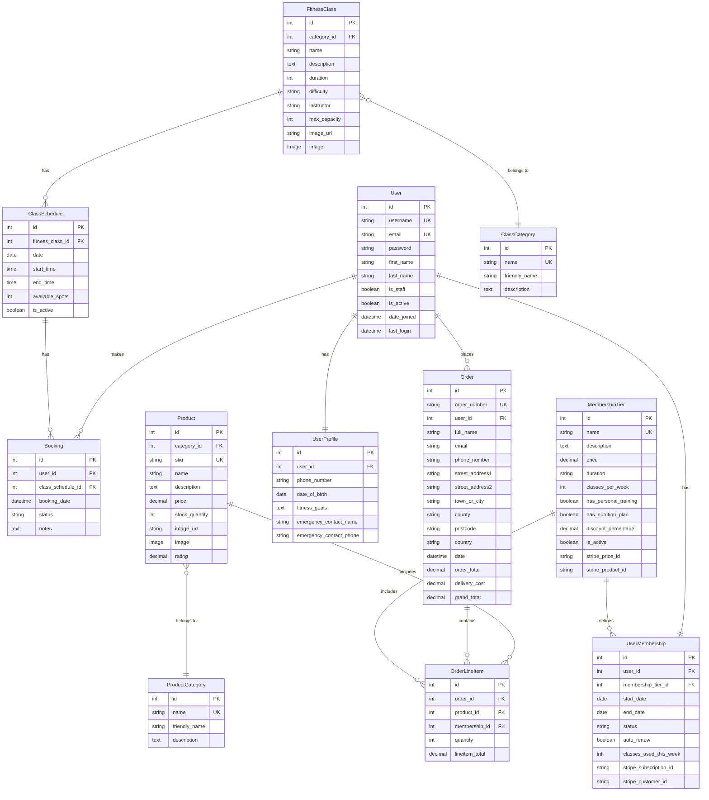

# Database Schema - Entity Relationship Diagram

## FitForge - Fitness Management System

## Model Relationships

### **User Model** (Django built-in)
- **One-to-One** with UserProfile (one user has one profile)
- **One-to-One** with UserMembership (one user has one active membership)
- **One-to-Many** with Booking (one user makes many bookings)
- **One-to-Many** with Order (one user places many orders)

### **UserProfile Model**
- **One-to-One** with User (each user has one profile)
- Stores additional user information (phone, emergency contacts, fitness goals)

### **ClassCategory Model**
- **One-to-Many** with FitnessClass (one category has many classes)

### **FitnessClass Model**
- **Many-to-One** with ClassCategory (many classes belong to one category)
- **One-to-Many** with ClassSchedule (one class has many scheduled sessions)

### **ClassSchedule Model**
- **Many-to-One** with FitnessClass (many schedules for one class)
- **One-to-Many** with Booking (one schedule has many bookings)
- Auto-sets available_spots from FitnessClass.max_capacity

### **Booking Model**
- **Many-to-One** with User (many bookings by one user)
- **Many-to-One** with ClassSchedule (many bookings for one schedule)
- **Unique Constraint**: One user can only book a specific schedule once

### **MembershipTier Model**
- **One-to-Many** with UserMembership (one tier has many user memberships)
- **One-to-Many** with OrderLineItem (memberships can be purchased through orders)
- Integrates with Stripe for recurring subscriptions

### **UserMembership Model**
- **One-to-One** with User (each user has one active membership)
- **Many-to-One** with MembershipTier (many memberships of one tier)
- Tracks subscription status, auto-renewal, and weekly class usage

### **ProductCategory Model**
- **One-to-Many** with Product (one category has many products)

### **Product Model**
- **Many-to-One** with ProductCategory (many products in one category)
- **One-to-Many** with OrderLineItem (one product in many order lines)

### **Order Model**
- **Many-to-One** with User (many orders by one user)
- **One-to-Many** with OrderLineItem (one order contains many line items)
- Auto-generates unique order_number using UUID
- Calculates delivery costs based on threshold

### **OrderLineItem Model**
- **Many-to-One** with Order (many line items in one order)
- **Many-to-One** with Product (many line items reference one product)
- **Many-to-One** with MembershipTier (many line items reference one membership)
- Can contain either a Product OR a MembershipTier (not both)

## Key Features

### Cascading Deletes
- **User deleted**: Profile and Membership are deleted (CASCADE)
- **FitnessClass deleted**: All schedules and bookings are deleted (CASCADE)
- **ClassSchedule deleted**: All bookings are deleted (CASCADE)
- **Order deleted**: All line items are deleted (CASCADE)

### Soft Deletes / SET_NULL
- **Category deleted**: Classes/Products remain but category set to NULL (SET_NULL)
- **User deleted**: Orders remain but user reference set to NULL (SET_NULL)
- **Product/Membership deleted**: OrderLineItem remains but reference set to NULL (SET_NULL)

### Unique Constraints
- **User**: username, email are unique
- **ClassCategory**: name is unique
- **ProductCategory**: name is unique
- **Product**: SKU is unique
- **Order**: order_number is unique
- **MembershipTier**: name is unique
- **Booking**: (user_id, class_schedule_id) combination is unique

### Status Fields
- **Booking**: confirmed, cancelled, attended, no_show
- **UserMembership**: active, expired, cancelled, pending
- **FitnessClass**: difficulty levels (beginner, intermediate, advanced, all_levels)
- **MembershipTier**: duration (monthly, quarterly, annually)

### Auto-Calculations
- **ClassSchedule.available_spots**: Auto-set from FitnessClass.max_capacity
- **Order.order_total**: Sum of all OrderLineItem.lineitem_total
- **Order.delivery_cost**: Based on FREE_DELIVERY_THRESHOLD
- **Order.grand_total**: order_total + delivery_cost

### Timestamps
- **Order**: date (auto_now_add)
- **Booking**: booking_date (auto_now_add)
- **UserMembership**: start_date, end_date
- **User**: date_joined, last_login

### External Integrations
- **Stripe Integration**:
  - MembershipTier stores stripe_price_id and stripe_product_id
  - UserMembership stores stripe_subscription_id and stripe_customer_id
  - Supports recurring subscription payments

### Business Rules
1. **Booking Constraints**: A user cannot book the same class schedule twice
2. **Capacity Management**: ClassSchedule tracks available_spots and decrements on booking
3. **Membership Limits**: UserMembership.classes_per_week limits weekly bookings
4. **Order Line Items**: Can contain either Product OR Membership, not both
5. **Delivery Threshold**: Orders above threshold get free delivery
6. **Auto-Renewal**: UserMembership can auto-renew via Stripe subscriptions

## Database Technology
- **Production**: PostgreSQL (Heroku Postgres)
- **Development**: SQLite3
- **ORM**: Django ORM
- **Migrations**: Django Migrations

## Indexes
Django automatically creates indexes on:
- Primary Keys (id)
- Foreign Keys (all _id fields)
- Unique fields (username, email, SKU, order_number, etc.)
- Fields used in ordering (date, created_at, name, etc.)
